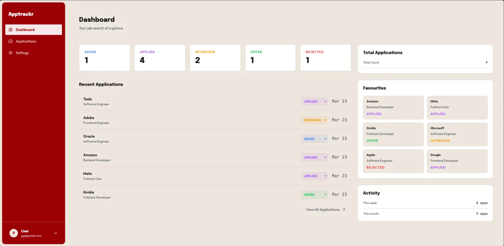

# Apptrackr — Job Application Tracker

A full-stack job application tracker built with Next.js 16, NestJS, TypeScript, Prisma 6, and PostgreSQL. Track applications through their full lifecycle — from saved to offer — with a clean dashboard, inline status updates, and favourites.

---

## Live Demo



[**VIEW LIVE**](https://apptrackr-amber.vercel.app/)

---

## Features

**Applications**

- Create, edit, and delete job applications
- Track company, role, status, salary, URL, date applied, and notes
- Filter by status — Saved, Applied, Interview, Offer, Rejected
- Search by company or role
- Sort by date, company name, or status (ascending/descending)

**Dashboard**

- Status breakdown cards — live counts per status
- Recent applications list with inline status changer
- Favourites panel — pin up to 6 applications as quick-access cards
- Activity stats — applications this week and this month
- Total application count

**Auth**

- Register and login with JWT
- Auto-logout on token expiry (401 interceptor)
- Update name, email, and password
- Delete account with cascade

**UI**

- Light / dark / system theme with smooth transitions
- Floating card layout with accent red sidebar
- Sonner toast notifications
- Fully responsive design

---

## Tech Stack

| Category     | Technology                    |
| ------------ | ----------------------------- |
| Monorepo     | Turborepo                     |
| Frontend     | Next.js 16 (App Router)       |
| Backend      | NestJS                        |
| Language     | TypeScript                    |
| Database     | PostgreSQL 17 (Render)        |
| ORM          | Prisma 6                      |
| Auth         | JWT (passport-jwt)            |
| State        | Redux Toolkit + react-redux   |
| HTTP Client  | Axios                         |
| Styling      | Tailwind CSS 4                |
| Components   | shadcn/ui                     |
| Animations   | Framer Motion                 |
| Toasts       | Sonner                        |
| Deployment   | Vercel (frontend) + Render (backend) |

---

## Project Structure

```
job-tracker/
├── apps/
│   ├── web/                    # Next.js frontend
│   │   ├── app/
│   │   │   ├── (app)/
│   │   │   │   ├── dashboard/  # Stats + recent apps + right panel
│   │   │   │   ├── applications/
│   │   │   │   │   ├── page.tsx        # Full list with search + sort + filter
│   │   │   │   │   ├── new/            # New application form
│   │   │   │   │   └── [id]/           # Edit + delete single application
│   │   │   │   ├── settings/           # Account, appearance, stats
│   │   │   │   └── layout.tsx          # Sidebar + floating card layout
│   │   │   ├── login/
│   │   │   ├── signup/
│   │   │   ├── store/                  # Redux slices (auth, applications, ui)
│   │   │   ├── hooks/useTheme.ts       # Light/dark/system theme logic
│   │   │   └── lib/axios.ts            # Axios instance + JWT + 401 interceptor
│   │   └── components/
│   │       ├── Sidebar.tsx             # Accent sidebar with user popup
│   │       └── StatusBadge.tsx         # Coloured status select
│   └── api/                    # NestJS backend
│       ├── src/
│       │   ├── auth/           # Register, login, me, update, delete
│       │   ├── applications/   # Full CRUD
│       │   └── prisma/         # PrismaService
│       └── prisma/
│           ├── schema.prisma
│           └── migrations/
└── packages/
    └── types/                  # Shared TypeScript types (User, Application, Status)
```

---

## Database Schema

```
┌──────────┐          ┌───────────────────┐
│   User   │──────1:N─│   Application     │
│          │          │                   │
│ id       │          │ id                │
│ email    │          │ userId            │
│ password │          │ company           │
│ name     │          │ role              │
│ createdAt│          │ status            │
└──────────┘          │ appliedAt         │
                      │ notes             │
                      │ salary            │
                      │ url               │
                      │ isFavorite        │
                      │ updatedAt         │
                      └───────────────────┘
```

Status enum: `SAVED | APPLIED | INTERVIEW | OFFER | REJECTED`

---

## API Routes

```
POST   /auth/register
POST   /auth/login
GET    /auth/me
PATCH  /auth/me
DELETE /auth/me

GET    /applications
POST   /applications
GET    /applications/:id
PATCH  /applications/:id
DELETE /applications/:id
```

All `/applications` routes are JWT-protected.

---

## Getting Started

### Prerequisites

- Node.js 18+
- PostgreSQL 17

### Installation

```bash
# Clone the repository
git clone https://github.com/davidupdesign/Apptrackr.git

# Navigate to project
cd job-tracker

# Install dependencies
npm install
```

### Environment Variables

**`apps/api/.env`**

```env
DATABASE_URL=postgresql://...
JWT_SECRET=your-random-secret
CORS_ORIGIN=http://localhost:3000
PORT=3001
```

**`apps/web/.env.local`**

```env
NEXT_PUBLIC_API_URL=http://localhost:3001
```

### Database Setup

```bash
cd apps/api
npx prisma migrate dev
```

### Run Development Server

```bash
# From root
npm run dev
```

Frontend runs on [http://localhost:3000](http://localhost:3000)
API runs on [http://localhost:3001](http://localhost:3001)

---

## Scripts

```bash
npm run dev        # Start all apps in dev mode
npm run build      # Build all apps
npm run lint       # Lint all apps
```

---

## Deployment

**Backend → Render**

- Runtime: Node
- Root Directory: `apps/api`
- Build Command: `npm install && npm run build && npx prisma migrate deploy`
- Start Command: `npm run start:prod`
- Environment variables: `DATABASE_URL`, `JWT_SECRET`, `CORS_ORIGIN`, `PORT`

**Frontend → Vercel**

- Root Directory: `apps/web`
- Framework: Next.js
- Environment variables: `NEXT_PUBLIC_API_URL`

---

## Author

David K — [GitHub](https://github.com/davidupdesign)